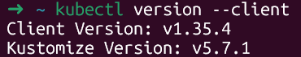
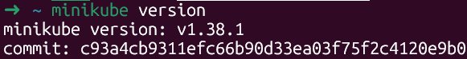
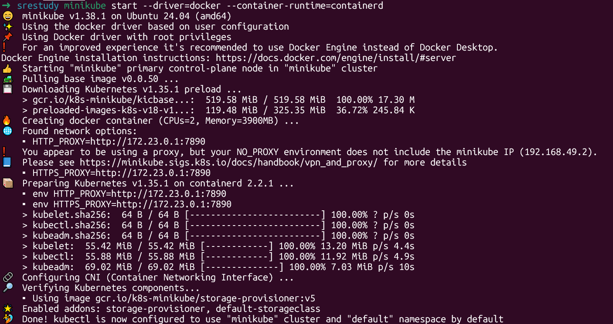
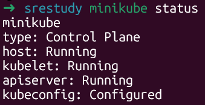

# kubernetes(k8s)基础学习
在现代软件开发中，我们通常把程序运行在容器内，以达到消除环境、依赖差异带来bug的目的。相比于虚拟机，容器更加轻量，极大提高了服务器资源的利用率。

随着应用规模扩大，容器数量逐渐增加，手动管理应用实例就将十分麻烦，如何解决容器崩溃？服务器资源占用满了以后新的容器在哪里运行？容器版本更新怎么处理？`kubernetes`(k8s)就是应对自动化解决此类问题而生的。

`k8s`应对上述问题，有以下几个优势

**自我修复 (Self-healing)**： 某个容器宕机了？k8s 会自动杀掉宕机容器并重新启动一个健康的容器继续工作

**弹性伸缩 (Scaling)**：当某个容器托管的服务用户量激增，k8s可以自动增加容器数量来保障服务的可靠性。例如双11时，订单量短时间内大量增加，k8s 可以根据 CPU 利用率自动增加容器数量来应对短时间内服务需求量快速增加；高峰期结束后则减少容器数量以节省成本。

**服务发现与负载均衡**:自给一堆容器分配统一的入口，并将流量均匀的分给这些容器，以提高服务稳定性。

**自动部署与回滚**：<br>**平滑升级**：采取先起一个新容器，再关闭一个旧容器，实现零停机更新。k8s可以一个一个将容器替换。<br>**快速止损**：如果新的代码有bug，执行一条命令即可瞬间撤回到上一个稳定版本。

由于 k8s 一般是使用在大型服务器集群上，本篇博客将使用 k8s 官方推荐的轻量化工具 minikube 来进行演示。

Minikube通过在本地（如笔记本电脑）运行虚拟机或 Docker 容器，模拟出一个单节点的 K8s 集群

## 1.安装并使用Minikube
### (1)确认环境
首先执行命令确认有docker环境
```bash
docker version
docker ps
```
正常返回后，检查CPU架构，执行
```bash
uname -m
```
一般是x86_64，arm架构的cpu则选用arm架构的下载包，本篇以x86为演示

### (2)安装kubectl
kubectl 是与集群交互的命令行工具。minikube 能自带一个临时版，但长期学习建议单独装好。

使用curl下载x86_64架构kubectl
```bash
curl -LO "https://dl.k8s.io/release/$(curl -L -s https://dl.k8s.io/release/stable.txt)/bin/linux/amd64/kubectl"
```
使用管理员权限安装并写入PATH(/usr/local/bin/kubectl)，将所有者所属组更改为root，其他用户拥有读，执行权限
```bash
sudo install -o root -g root -m 0755 kubectl /usr/local/bin/kubectl
```
执行命令检查是否安装成功，安装成功将会返回版本号
```bash
kubectl version --client
```


### (3)安装 minikube
使用curl下载x86_64架构minikube
```bash
curl -LO https://storage.googleapis.com/minikube/releases/latest/minikube-linux-amd64
```

同样，安装下载文件并放入PATH
```bash
sudo install minikube-linux-amd64 /usr/local/bin/minikube
```

执行命令检查minikube安装是否成功
```bash
minikube version
```


### (4)启动集群
使用`minikube start`启动集群
```bash
minikube start --driver=docker --container-runtime=containerd
```

`--driver=docker`：集群跑在docker里
`--container-runtime=containerd`：让集群内部用 containerd 跑容器，这是更常见、更推荐的方式。

正常情况下，minikube 会自动创建 `kubeconfig`，所以后面 kubectl 就能直接连上这个集群。


### (5)验证集群
执行以下命令
```bash
minikube status
```

`minikube`:集群名称
`type:Control Plane`:定义当前节点的角色Control Plane，负责pod资源调度，响应系统事件，维护集群状态。
`kubelet